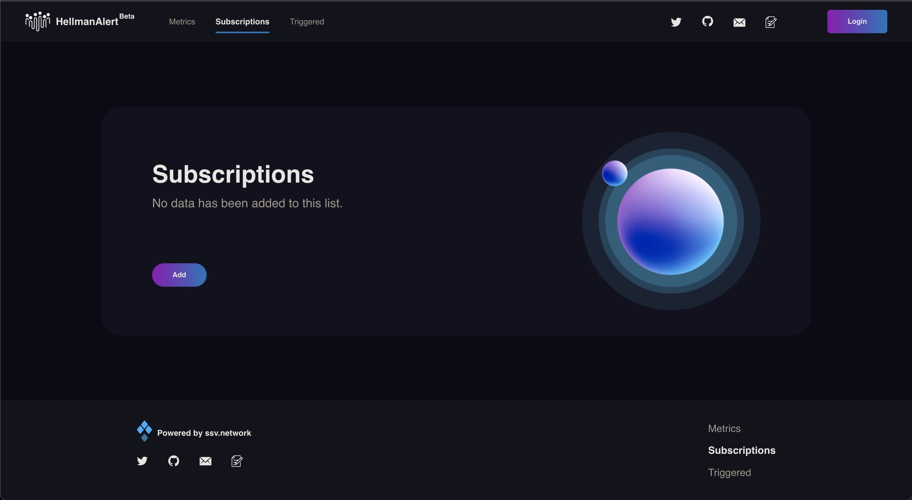

# Welcome to the HellmanAlert documentation

HellmanAlert for ssv.network is a system that monitors the status, fee and performance change of the Operators as well as the deposited balance of the accounts! Users are able to select the metrics they wish to subscribe and receive notifications by email, discord or webhook as soon as the criteria were triggered.

There are three main panels on the user interface, Metrics, Subscriptions and Triggered. 
