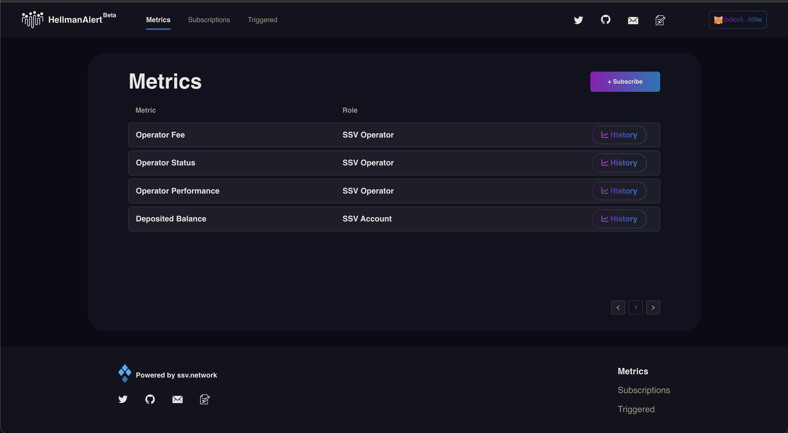
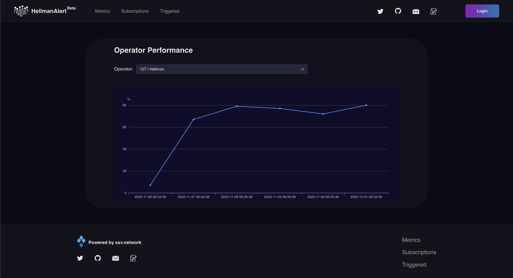

# Metrics

Metrics provides an overview of the historical data of the Operator Fee, Operator Status, Operator Performance and the Deposited Balance of the selected account.

By simply clicking the History button and selecting the Operator/Account, the system will demonstrate the historical data for up to a month.