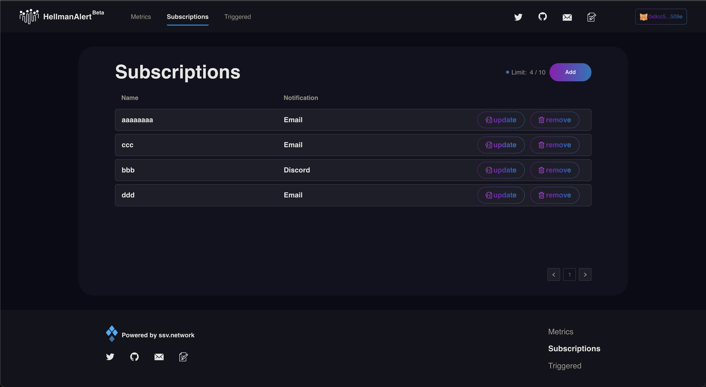
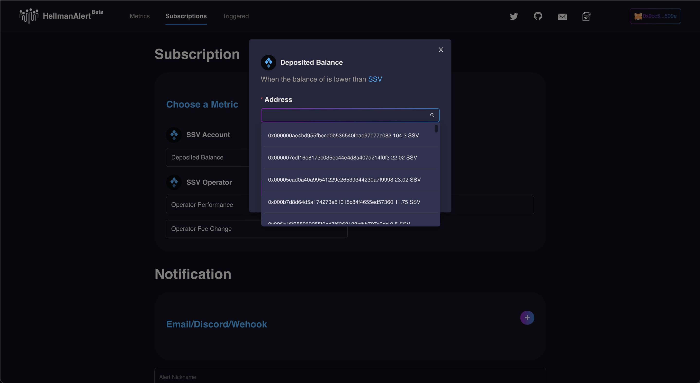
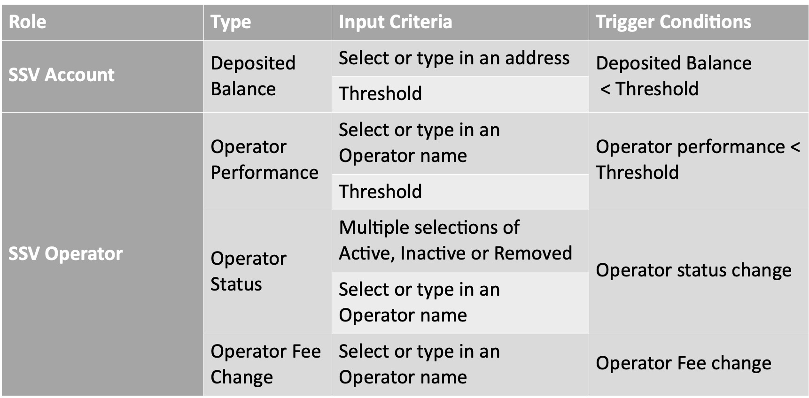
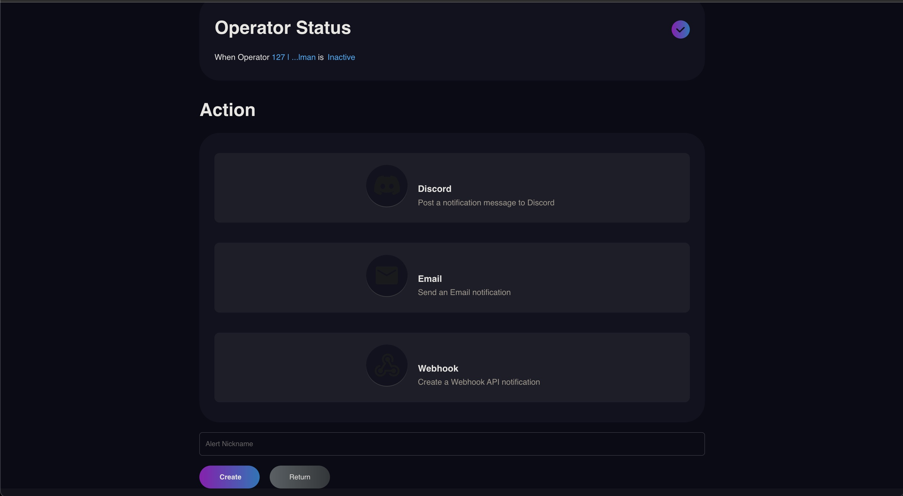
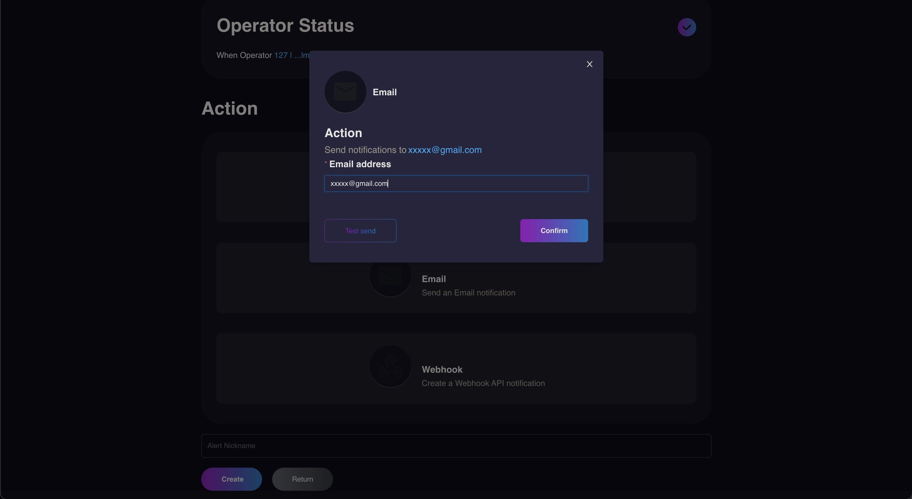
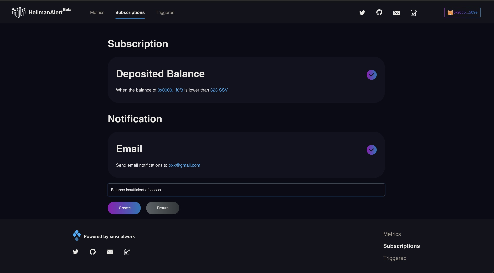

# Subscriptions

Subscribing to a notification is the core function of the HellmanAlert. Users can access through the “+Subscribe” button on the top right corner of the Metrics panel or the “Add” button on the top right corner of the Subscriptions panel.

The following table outlines the input criteria and the trigger conditions of the available metrics.

Notifications can be received through Discord (Webhook automated message), Email or backend Webhook API. Users are able to test send before subscribe. When choosing Discord, make sure to type in Discord Webhook URL instead of the Discord user name. Check out the detailed instruction here or click the question mark on Discord Action page.

The check marks indicated that both notification criteria and delivery method are completed correctly. But do not forget to add a Nickname for your convenience and click the save button.

All the notifications subscribed are listed under the Subscriptions panel, which gives users options to update, remove and add (as mentioned earlier) subscriptions on the page. 