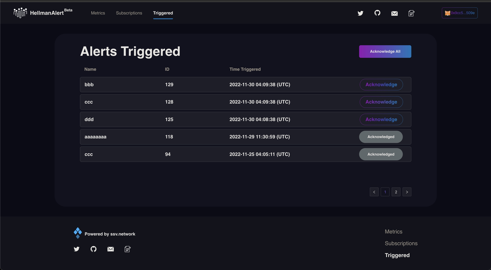

# Triggered

When the alert was triggered, notification messages will be sent to the users. In the messages, users can be directed to the page to update the subscriptions or stop the system from sending reminders. 

Alerts that triggered will be displayed under the Triggered panel. If no actions have been made, the system will send another two follow up reminders one day apart from each other. Users can click acknowledge in the page or in email notifications to stop system from sending reminders. 